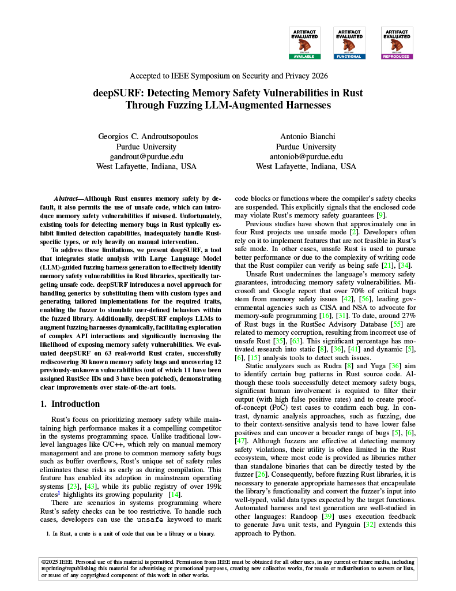

# deepSURF

<a href="deepSURF.pdf" target="_blank"></a>
deepSURF is a tool that combines static analysis and LLM capabilities to automatically generate fuzzing harnesses that can be used by a fuzzer to expose memory safety vulnerabilities in Rust libraries.

This repository contains materials for the paper _deepSURF: Detecting Memory Safety Vulnerabilities in Rust Through Fuzzing LLM-Augmented Harnesses_, which is accepted at the IEEE Symposium on Security and Privacy 2026 ([IEEE S&P '26](https://sp2026.ieee-security.org/)).


deepSURF received all three Artifact Evaluation badges (Available, Functional, Reproduced). The evaluated artifacts are archived on Zenodo: [AE package](https://zenodo.org/records/17115101).

> **Note:** This repository’s layout differs slightly from the AE package and includes newer code plus extended results. We will continue to publish updates here, including bug fixes, new features, and additional experimental results.

---

## Repository Layout

- [`code/`](./code) — Core source tree.
  - [`rust/`](./code/rust) — Extended **rustc 1.81.0-dev** used for static analysis; the key changes are concentrated in:
      - [`rust/compiler/rustc_driver_impl/src/lib.rs`](./code/rust/compiler/rustc_driver_impl/src/lib.rs)
      - [`rust/compiler/rustc_surf/src/lib.rs`](./code/rust/compiler/rustc_surf/src/lib.rs)
  - [`harness_generator/`](./code/harness_generator) — Harness generation component.
  - [`global_data/`](./code/global_data) — Library to create global DATA from the fuzzer’s data.
  - [`fuzzer/`](./code/fuzzer) — Configured **afl.rs** crate.
- [`dataset/`](./dataset) — Datasets used in evaluation.
- [`rqs/`](./rqs) — Experimental results (research questions).
  - [`rqs/rq1`](./rqs/rq1) — Proof-of-concept (PoC) cases for bugs found by deepSURF.
  - [`rqs/rq2`](./rqs/rq2) — Fuzz harnesses and _URAPI Coverage_ statistics for deepSURF and other Rust fuzzing tools.
  - [`rqs/rq3`](./rqs/rq3) — Ablation study artifacts.


---

## System Requirements
- **Platform:** deepSURF has been tested on Linux (amd64). It is suggested to run inside a Docker container.
- **Recommended host resources:**
  - Harness generation: ≥ 10 CPU cores, ≥ 64 GB RAM, ≥ 100 GB free disk.
  - Fuzzing: depends on the number of harnesses under test and the fuzzing configuration.
- **LLM access:** Provide your own OpenRouter API key to generate fuzz harnesses.
  
---

## Build
To install deepSURF inside a docker container, from the repository root:

```bash
cd code

# One-step setup (build + any initial prep)
./install.sh

# — or do it manually —
./build-docker.sh   # builds the image (deepsurf:latest)
./run-docker.sh     # starts the container
# For optional AFL core-dumps, you may need extra privileges when running the container (e.g., `--privileged --ulimit core=-1`).
```

---

## Run

The script `generate_harnesses.sh` includes the commands to reproduce the fuzz harnesses for our dataset. At the beginning of the script, we set some of the tool’s parameters.  
The variable `OPENROUTER_API_KEY` must be set to your personal OpenRouter API key.

### Tool Parameters
Harness generation can be configured through the following key parameters:

- `SURF_ENABLE_LLMS=1` — Enable the LLM-based augmentation component.
- `SURF_SKIP_OPTION="<skip-option>"` — Select the skip option (default: `condskip`).
- `OPENROUTER_API_KEY="<YOUR_OPENROUTER_API_KEY>"` — Your OpenRouter API key.
- `SURF_DISABLE_LLM_DOCUMENTATION=1` — Disable inclusion of documentation in the prompt (useful when the LLM context window is limited).
- `SURF_ENABLE_FEATURES` — Cargo features to enable when compiling the fuzz harness (see `generate_harnesses.sh` for examples).
- `SURF_EXTRA_DEPS` — Extra Cargo dependencies to include when compiling the fuzz harness (see `generate_harnesses.sh` for examples).
- `SURF_ENABLE_LINE_COVERAGE=1` — Include `llvm-cov` instrumentation in generated fuzz harnesses.
- `LLM_BACKEND="<llm-backend>"` — LLM backend name (per OpenRouter’s naming) (default:`deepseek/deepseek-r1`).

### Example

Assume we want to generate harnesses for the crate **algorithmica-0.1.8**, whose source code is at `$HOME/deepSURF/dataset/erasan_crates/algorithmica-0.1.8/`.

The script `generate_harnesses.sh` already contains the commands to generate fuzz harnesses for **algorithmica-0.1.8**, so you can run it directly.  
All commands for reproducing the rest of our evaluation are commented out.

Below, we explain—step by step—the commands we execute in the script to generate the harnesses.  
You can follow the same steps to generate harnesses for any Rust library crate.

First, run the static analysis:
```bash
export SURF_HARNESS_GENERATOR_PATH=$HOME/deepSURF/code/harness_generator
export GLOBAL_DATA_PATH=$HOME/deepSURF/code/global_data
export SURF_ANALYZE_LIB=1  # Enable static analysis for a library crate
export SURF_WORKING_PATH=$HOME/deepSURF/dataset/erasan_crates/algorithmica-0.1.8/  # Path to the target library
cd "$SURF_WORKING_PATH" && cargo clean && RUSTFLAGS="-Zub-checks=no -Awarnings" cargo +rustc_surf build  # Run static analysis
unset SURF_ANALYZE_LIB
```

The key outputs of the static analysis can be found in `$HOME/deepSURF/dataset/erasan_crates/algorithmica-0.1.8/deepSURF/report`:
- `algorithmica_<hash>.urapi.json` — Detected _URAPIs_ of the library after argument type analysis.
- `algorithmica_<hash>.cmplx_tys.json` — Mapping between complex types and constructor APIs.
- `algorithmica_<hash>.stats.json` — Summary statistics of the static analysis.

To generate the harnesses from the static analysis output, run:
```bash
cd $SURF_HARNESS_GENERATOR_PATH && RUSTFLAGS="-Awarnings" cargo run --release "$(ls "$HOME/deepSURF/dataset/erasan_crates/algorithmica-0.1.8/deepSURF/report"/*.urapi.json | head -n1 | sed -E 's/\.urapi\.json$//')"  # Run the harness generator using the static analysis output
# For more details, see `generate_harnesses.sh` and its comments.
```

The main outputs of harness generation are in `$HOME/deepSURF/dataset/erasan_crates/algorithmica-0.1.8/deepSURF/`:
- `fuzz/fuzzing_corpus/` — Fuzzing corpus.
- `deepsurf_stats.txt` — Summary statistics of the harness generation.


The fuzz harnesses are located in `fuzz/fuzzing_corpus/`. How you fuzz them depends on your system (e.g., all at once or in batches).  
We provide `fuzz-algo.sh` as an example to fuzz all harnesses in parallel under: `$HOME/deepSURF/dataset/erasan_crates/algorithmica-0.1.8/deepSURF/fuzz/fuzzing_corpus/`.  
In this script, each harness is fuzzed with two parallel AFL++ threads in a master–slave setup: one with **ASan** enabled and one with **CmpLog** enabled.

---

## Memory Corruption Vulnerabilities Found by deepSURF

The table below lists memory safety bugs identified by deepSURF on our dataset.

_Columns_: Dataset, No, [RustSec ID](https://rustsec.org/) (if assigned), Crate, Affected Function/Trait, Bug Type.  
_Bug type codes_: DF = double free, HBOF/SBOF = heap/stack buffer overflow, UAF = use after free, MEMCRP = other memory corruption violations such as arbitrary memory access and dropping of uninitialized memory. The previously-unknown bugs discovered by deepSURF are marked with `*`.

---

| Dataset | No  | RustSec ID         | Crate              | Affected Function/Trait                  | Bug Type |
|:------:|:---|:-------------------|:-------------------|:-----------------------------------------|:-------:|
| ERASan | 1   | RUSTSEC-2021-0053  | algorithmica       | `merge_sort::merge`                      | DF      |
| ERASan | 2\* | RUSTSEC-2025-0062  | toodee             | `TooDee::remove_col`                     | HBOF    |
| ERASan | 3   | RUSTSEC-2021-0028  | toodee             | `TooDee::insert_row`                     | HBOF    |
| ERASan | 4   | RUSTSEC-2021-0028  | toodee             | `TooDee::insert_row`                     | DF      |
| ERASan | 5   | &mdash;            | toodee             | `TooDee::insert_col`                     | HBOF    |
| ERASan | 6   | RUSTSEC-2021-0033  | stack_dst          | `StackA::push_cloned`                    | DF      |
| ERASan | 7   | &mdash;            | stack_dst          | `StackA::push_stable`                    | DF      |
| ERASan | 8   | RUSTSEC-2021-0047  | slice-deque        | `SliceDeque::drain_filter`               | DF      |
| ERASan | 9\* | RUSTSEC-2025-0044  | slice-deque        | `SliceRingBuffer::insert`                | DF      |
| ERASan | 10\*| RUSTSEC-2025-0044  | slice-deque        | `slice_ring_buffer::IntoIter::clone`     | DF      |
| ERASan | 11\*| RUSTSEC-2025-0044  | slice-deque        | `SliceRingBuffer::extend_from_slice`     | DF      |
| ERASan | 12\*| RUSTSEC-2025-0044  | slice-deque        | `SliceRingBuffer::shrink_to_fit`         | DF      |
| ERASan | 13  | RUSTSEC-2021-0048  | stackvector        | `StackVec::extend`                       | SBOF    |
| ERASan | 14  | RUSTSEC-2021-0042  | insert_many        | `Insert_many::Vec::insert_many`          | DF      |
| ERASan | 15  | RUSTSEC-2019-0009  | smallvec-0.6.6     | `SmallVec::grow`                         | DF      |
| ERASan | 16  | RUSTSEC-2021-0003  | smallvec-1.6.0     | `SmallVec::insert_many`                  | HBOF    |
| ERASan | 17  | RUSTSEC-2020-0039  | simple-slab        | `Slab::index`                            | MEMCRP  |
| ERASan | 18  | RUSTSEC-2020-0039  | simple-slab        | `Slab::remove`                           | HBOF    |
| ERASan | 19  | RUSTSEC-2020-0038  | ordnung            | `CompactVec::remove`                     | DF      |
| ERASan | 20\*| &mdash;            | ordnung            | `CompactVec::remove`                     | UAF     |
| ERASan | 21  | RUSTSEC-2020-0005  | cbox               | `CBox::<T>::new`                         | MEMCRP  |
| ERASan | 22  | RUSTSEC-2021-0018  | qwutils            | `VecExt::insert_slice_clone`             | DF      |
| ERASan | 23  | RUSTSEC-2021-0039  | endian_trait       | `slices::Endian::from_be`                | DF      |
| ERASan | 24  | RUSTSEC-2020-0167  | pnet_packet        | `MutablepV4Packet::set_payload`          | HBOF    |
| ERASan | 25  | RUSTSEC-2021-0094  | rdiff              | `BlockHashes::diff_and_update`           | HBOF    |
| ERASan | 26  | RUSTSEC-2021-0049  | through            | `through::through`                       | DF      |
| RustSan| 27  | RUSTSEC-2018-0003  | smallvec-0.6.1     | `SmallVec::insert_many`                  | DF      |
| RustSan| 28  | RUSTSEC-2018-0008  | slice-deque-0.1.15 | `SliceDeque::move_head_unchecked`        | MEMCRP  |
| RustSan| 29  | RUSTSEC-2019-0012  | smallvec-0.6.3     | `SmallVec::grow`                         | MEMCRP  |
| RustSan| 30  | RUSTSEC-2020-0041  | sized-chunks       | `Chunk::insert_from`                     | DF      |
| RustSan| 31  | RUSTSEC-2020-0041  | sized-chunks       | `Chunk::insert_from`                     | SBOF    |
| RustSan| 32  | RUSTSEC-2020-0006  | bumpalo-3.2.0      | `bumpalo::realloc`                       | HBOF    |
| RustSan| 33  | RUSTSEC-2020-0047  | array-queue        | `array_queue::ArrayQueue::pop_back`      | MEMCRP  |
| RustSan| 34\*| RUSTSEC-2025-0054  | array-queue        | `array_queue::ArrayQueue::push_front`    | MEMCRP  |
| RustSan| 35\*| RUSTSEC-2025-0049  | scratchpad         | `scratchpad::Tracking`                   | HBOF    |
| RustSan| 36\*| RUSTSEC-2025-0053  | arenavec           | `arenavec::common::SliceVec::split_off`  | DF      |
| RustSan| 37\*| RUSTSEC-2025-0053  | arenavec           | `arenavec::common::allocate_inner`       | HBOF    |
| RustSan| 38\*| RUSTSEC-2025-0053  | arenavec           | `arenavec::common::AllocHandle`          | MEMCRP  |
| RustSan| 39  | RUSTSEC-2021-0052  | id-map             | `IdMap::clone_from`                      | DF      |
| RustSan| 40  | RUSTSEC-2021-0052  | id-map             | `IdMap::get_or_insert_with`              | DF      |
| RustSan| 41\*| RUSTSEC-2025-0050  | id-map             | `IdMap::from_iter`                       | MEMCRP  |
| CrabTree| 42 | &mdash;            | leapfrog           | `HashMap::insert`                        | MEMCRP  |


## Notes

- Each research question subdirectory includes a dedicated README explaining its contents.

---